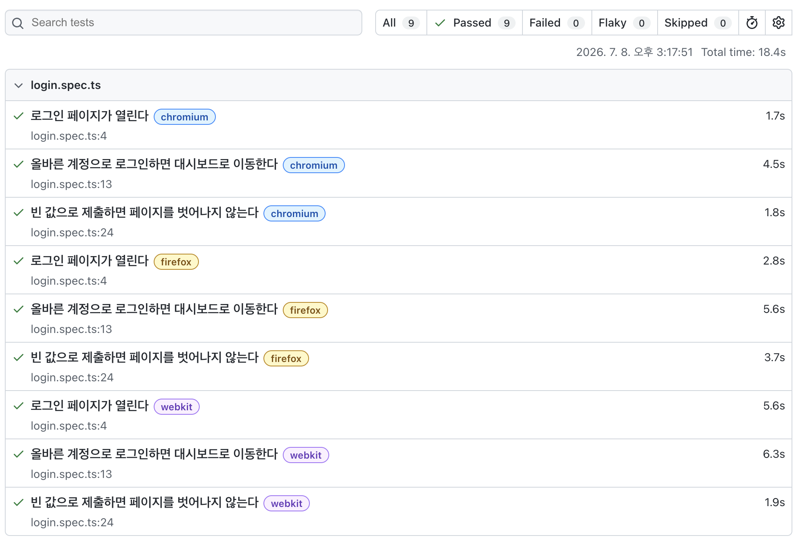

# Lernbox

> 독일어 AI 단어장 — Next.js 풀스택 개인 프로젝트
>
> **품질 관점 요약:** 단위·통합·컴포넌트·E2E **4단 테스트 피라미드**를 갖춘 프로젝트에서, E2E 자동화와 CI 파이프라인을 직접 구축하고, AI가 생성한 하위 테스트를 **직접 검증**했습니다. 크로스 브라우저 환경에서 발견한 버그 2건을 **trace 기반으로 추적·해결**했습니다.


**배포:** https://lernbox.vercel.app
**GitHub:** https://github.com/osoon9295/lernbox

---

## 프로젝트 성격

Lernbox는 Claude Code를 활용해 구현한 **AI-assisted 학습 프로젝트**입니다.
저는 이 프로젝트에서 기능 구현 자체보다, **생성된 코드와 테스트를 QA/SDET 관점에서 검증**하고
**E2E 자동화, CI 파이프라인, 크로스 브라우저 디버깅**을 직접 수행하는 데 초점을 두었습니다.

제가 직접 책임진 영역은 다음과 같습니다.

- Playwright 기반 로그인 E2E 테스트 설계 및 구현
- Page Object Model 적용
- GitHub Actions 기반 테스트 자동화 환경 구성
- CI용 PostgreSQL 테스트 DB 격리
- WebKit 전용 로그인 실패 2건 trace 기반 분석 및 해결 (아래 [트러블슈팅](#트러블슈팅))
- AI 생성 테스트의 mutation 방식 검증 (아래 [AI 생성 테스트 검증](#ai-생성-테스트-검증))

---

## 목차

- [품질 보장 전략](#품질-보장-전략) — 테스트 피라미드 / E2E / CI 파이프라인
- [AI 생성 테스트 검증](#ai-생성-테스트-검증) — 층별 고장내기(mutation) 3건
- [트러블슈팅](#트러블슈팅) — 크로스 브라우저 버그 추적 사례 2건
- [이 프로젝트의 한계와 다음 개선 계획](#이-프로젝트의-한계와-다음-개선-계획)
- [프로젝트 소개](#프로젝트-소개)
- [기술 스택](#기술-스택)
- [아키텍처 & 설계 결정](#아키텍처--설계-결정)
- [로컬 실행](#로컬-실행)

---

## 품질 보장 전략

### 테스트 피라미드

각 레이어가 서로 다른 관심사를 검증하도록 4단으로 구성돼 있습니다. 빠르고 많은 단위 테스트가 아래를 받치고, 느리지만 사용자 흐름 전체를 검증하는 E2E가 위를 덮습니다.

| 레이어            | 파일                                      | 방식                               | 케이스 | 작업 구분           |
| ----------------- | ----------------------------------------- | ---------------------------------- | ------ | ------------------- |
| 단위 (알고리즘)   | `app/lib/srs.test.ts`                     | Jest — 순수 함수, 경계값 검증      | 17     | AI 생성 → 직접 검증 |
| 통합 (API 라우트) | `app/api/words/[id]/review/route.test.ts` | Jest + Prisma/auth 모킹            | 9      | AI 생성 → 직접 검증 |
| 컴포넌트          | `app/review/page.test.tsx`                | React Testing Library + fetch 모킹 | 9      | AI 생성 → 직접 검증 |
| E2E               | `tests/login.spec.ts`                     | Playwright (POM) × 3 브라우저      | 9      | **직접 작성**       |

> 단위·통합·컴포넌트 합계 35개 + E2E 9개. CI에서 push/PR마다 전체 자동 실행.

**피라미드를 지키는 이유** — 단위 테스트는 빠르고 비용이 낮아 로직 구석구석을 촘촘히 덮고 버그 위치도 정확히 짚어줍니다. 반대로 E2E는 느리고 불안정해질 수 있어 로그인 같은 핵심 흐름에 집중합니다. E2E만 비대한 역피라미드는 느리고 플래키해지는 안티패턴이라, 아래를 두껍게 유지했습니다.

### E2E 자동화 (Playwright) — 직접 작성

- **Page Object Model**로 셀렉터와 동작을 `LoginPage` 클래스에 캡슐화 — UI 변경 시 한 곳만 수정하면 모든 테스트에 반영됩니다.
- 로그인 핵심 흐름을 검증: 성공 / 잘못된 비밀번호 / 빈 값 / **User Enumeration 방어**(실패 메시지 통일 확인).
- **auto-waiting** 기반 — 고정 대기(`sleep`) 없이 조건 충족까지 재시도해 플래키 테스트를 방지합니다.
- Chromium·Firefox·**WebKit** 3개 브라우저에서 교차 검증.



### CI 파이프라인 (GitHub Actions) — 직접 구성

테스트 성격에 따라 워크플로우를 **2개로 분리**했습니다.

| 워크플로우       | 역할                                                | 트리거           |
| ---------------- | --------------------------------------------------- | ---------------- |
| `ci.yml`         | 타입 체크(`tsc --noEmit`) + Jest 단위·통합·컴포넌트 | push / PR (main) |
| `playwright.yml` | E2E (임시 DB 포함)                                  | push / PR (main) |

**CI에서의 테스트 DB 전략** — 운영 DB 오염을 막기 위해 CI 안에서 DB를 격리했습니다.

```
1. services: postgres   → CI 안에 임시 PostgreSQL 프로비저닝 (매 실행 새 인스턴스)
2. prisma migrate deploy → schema.prisma 기준으로 테이블 생성
3. prisma db seed        → 테스트 계정 주입
4. playwright test       → 시드된 계정으로 로그인 E2E 실행
```

- 운영 Supabase와 **완전 격리** — 테스트가 실제 사용자 데이터를 건드릴 수 없습니다.
- 매 실행 깨끗한 상태에서 시작 → 테스트 간 오염 없음.
- 민감 값(JWT 시크릿·테스트 계정)은 **GitHub Secrets**로 관리, 운영 키와 분리.

> Prisma 7에서는 시드 설정을 `package.json`이 아니라 `prisma.config.ts`에 등록해야 CI에서 동작합니다 (직접 확인).

---

## AI 생성 테스트 검증

단위·통합·컴포넌트 테스트는 AI가 생성했습니다. 저는 이 코드를 그대로 신뢰하는 대신, **각 테스트를 한 줄씩 읽고, 대상 코드를 의도적으로 고장내(mutation testing) "이 테스트가 실제로 무엇을 지키는지"를 확인**했습니다. 세 층 모두 "예측 → 고장 → 결과 확인" 순서로 검증했습니다.

| 층       | 대상            | 고장낸 지점                      | 결과 → 확인한 것                                                                                                                                    |
| -------- | --------------- | -------------------------------- | --------------------------------------------------------------------------------------------------------------------------------------------------- |
| 단위     | SM-2 (`srs.ts`) | `easeFactor` 하한 `1.3` 제거     | easeFactor 검증 테스트만 실패 → 이 하한이 "어려운 단어가 매일 복습 큐에 갇히는 것"을 막는 안전장치임을 확인                                         |
| 통합     | review route    | 소유권 검사(`userId` 비교) 제거  | IDOR 테스트만 실패, "존재하지 않는 단어 → 404"는 통과 → 이 한 줄이 IDOR 방어의 핵심임을 확인                                                        |
| 컴포넌트 | `ReviewPage`    | `revealed` 초기값 `false → true` | 9개 중 6개 실패. 그중 버그의 **본질**(뜻 조기 노출)을 잡은 건 `queryByText(뜻).not` 한 줄이고, 나머지 5개는 **부작용**(답 보기 버튼 소멸)에 걸린 것 |

**여기서 확인한 QA 원칙**

- **각 테스트의 방어 범위** — 한 곳을 고장내면 관련 테스트만 정확히 실패한다. 관심사가 잘 분리돼 있으면 실패가 원인을 정조준한다.
- **부정 조건(negative assertion)의 역할** — `.not.toHaveBeenCalled()`(통합, IDOR 시 수정 미실행)와 `.not.toBeInTheDocument()`(컴포넌트, 답 보기 전 뜻 숨김)는 "일어나면 안 되는 일이 안 일어났는지"를 검증하는 안전장치다.
- **원인과 부작용의 구분** — 하나의 버그가 여러 테스트를 실패시킬 때, 원인을 정조준한 테스트와 곁다리로 무너진 테스트를 구분하는 것이 디버깅의 핵심이다.

---

## 트러블슈팅

크로스 브라우저 E2E를 운영하며 **WebKit에서만 재현되는 버그 2건**을 마주쳤고, 각각 다른 층위의 원인을 추적해 해결했습니다.

### 1. WebKit 전용 로그인 실패 — Secure 쿠키와 실행 환경

| 항목     | 내용                                                                                                                                                                                                                                                                                                                         |
| -------- | ---------------------------------------------------------------------------------------------------------------------------------------------------------------------------------------------------------------------------------------------------------------------------------------------------------------------------- |
| **문제** | 3개 브라우저 중 WebKit에서만 로그인 후 `/dashboard` 진입에 실패하고 `/login`에 잔류                                                                                                                                                                                                                                          |
| **원인** | E2E를 프로덕션 빌드(`npm run build && start`)로 실행 → `NODE_ENV=production` → 인증 쿠키에 `Secure` 속성 부착. `Secure` 쿠키는 HTTPS에서만 저장되는데 테스트는 `http://localhost`에서 실행됨. Chromium·Firefox는 localhost를 secure context 예외로 처리하지만 **WebKit은 예외 없이 거부** → 토큰 미저장 → 미들웨어 인증 실패 |
| **해결** | E2E 실행을 dev 서버(`npm run dev`)로 전환해 `secure: false`로 발급. 프로덕션 쿠키 동작은 검증 범위에서 제외된다는 **트레이드오프를 인지하고 선택**                                                                                                                                                                           |
| **교훈** | 코드(설정값)뿐 아니라 **실행 맥락(prod vs dev)까지 의심**해야 한다. 단일 브라우저만 테스트했다면 놓쳤을 버그                                                                                                                                                                                                                 |

### 2. CI WebKit 로그인 실패 — DOM 값과 React state 불일치

| 항목     | 내용                                                                                                                                                                                                                                                                                         |
| -------- | -------------------------------------------------------------------------------------------------------------------------------------------------------------------------------------------------------------------------------------------------------------------------------------------- |
| **문제** | 로컬에서는 9개 모두 통과하나 CI의 WebKit에서만 로그인 성공 테스트가 실패                                                                                                                                                                                                                     |
| **원인** | **Playwright trace 분석** 결과, 입력값 검증(`toHaveValue`)은 통과하는데 제출 시 이메일이 빈 값. `fill()`은 DOM input 값은 채우지만, 느린 CI/WebKit 환경에서 React `onChange`를 트리거하지 못해 **제출되는 React state가 비어 있던 것**이 원인 (race condition이라 빠른 로컬에선 우연히 통과) |
| **해결** | `fill()` → `pressSequentially()`로 한 글자씩 입력해 `onChange`를 확실히 발생시켜 state 동기화 보장                                                                                                                                                                                           |
| **교훈** | 증상(브라우저 차이)이 아닌 **데이터(trace)로 원인을 규명**한다. "모든 브라우저가 동일하게 실패하면 환경 문제, 특정 브라우저만 실패하면 그 브라우저 특성"                                                                                                                                     |

> 두 사례 모두 **trace·스크린샷 등 실패 아티팩트를 근거로** 추적했습니다. CI는 실패 시 Playwright HTML 리포트를 아티팩트로 보관합니다.

---

## 이 프로젝트의 한계와 다음 개선 계획

- E2E 범위가 로그인 중심이라, 단어 CRUD/복습/AI 분석 플로우로 확장 필요
- Postman/Newman 기반 API 테스트 자동화 추가 필요
- 테스트 케이스 문서와 버그 리포트 산출물 보강 필요
- 테스트 결과 리포트와 요구사항-테스트 매핑표 추가 필요
  
---

## 프로젝트 소개

독일 Bochum 어학연수 중 마주쳤던 단어들을 기록하고 싶었는데, 기존 단어장 앱은 단순 암기 위주라 뉘앙스나 예문을 따로 찾아야 했습니다. 직접 쓸 도구가 필요해 만든 학습 프로젝트입니다.

**핵심 흐름:**

1. 단어 입력 → Claude AI가 뜻·문법·예문 3개·뉘앙스·학습팁을 스트리밍으로 분석
2. SM-2 알고리즘이 복습 간격을 계산해 오늘 복습할 단어만 노출
3. 복습 후 체감 난이도(다시/어려움/좋음/쉬움) 평가 → 다음 복습일 자동 조정

### 주요 기능

| 기능              | 설명                                                                     |
| ----------------- | ------------------------------------------------------------------------ |
| 회원가입 / 로그인 | bcrypt 해싱 + JWT(Access 15분 / Refresh 7일) + HttpOnly Cookie           |
| 단어 CRUD         | 추가·인라인 수정·삭제, 다른 사용자 단어 접근 차단(IDOR 방어)             |
| AI 분석           | Claude Haiku 4.5 스트리밍 — 토큰 생성 즉시 화면 표시, 완료 후 DB 저장    |
| 복습 시스템       | SM-2 알고리즘 기반 SRS — 오늘 복습할 단어만 카드로 노출                  |
| 빈칸 퀴즈         | AI 예문의 단어를 `____`로 대체, 직접 입력해 맞히는 퀴즈                  |
| 대시보드          | 스탯 카드 4종 / 주간 복습 바 차트 / 복습 대기 CTA                        |
| 단어장            | 단어 추가·수정·삭제·AI 분석, 단어·뜻 실시간 검색 필터링                  |
| 인증 미들웨어     | Edge Runtime에서 JWT 검증, 미인증 접근 시 `/login` 리다이렉트            |
| 세션 자동 갱신    | Refresh Token Rotation — 만료 시 자동 재발급, 재사용 감지 시 세션 무효화 |

---

## 기술 스택

| 분류               | 기술                                             |
| ------------------ | ------------------------------------------------ |
| Frontend / Backend | Next.js 16 (App Router) + TypeScript 5           |
| Database           | Supabase (PostgreSQL, Seoul 리전)                |
| ORM                | Prisma 7.8 — driver adapter 방식 (Rust-free)     |
| 인증               | bcrypt 6 + jose 6 (JWT) + HttpOnly Cookie        |
| AI                 | Anthropic Claude API (`@anthropic-ai/sdk`)       |
| 검증               | Zod 4                                            |
| UI                 | Tailwind CSS 4 + shadcn-ui + Recharts            |
| 테스트             | Jest 30 + React Testing Library + **Playwright** |
| CI/CD              | GitHub Actions + Vercel                          |

---

## 아키텍처 & 설계 결정

> 아래 설계는 AI로 구현했으며, 각 결정의 의도를 이해한 범위에서 정리했습니다.

### IDOR 방어

수정·삭제·분석·복습 API는 모두 `word.userId === 요청자 userId`를 검증합니다. 타인의 단어 ID를 직접 호출해도 404를 반환해 존재 여부조차 노출하지 않습니다. 라우트는 방어선을 **인증(401) → 존재·소유권(404) → 입력 검증(400) → 처리** 순으로 배치해, 자격 없는 요청이 데이터 처리 단계까지 도달하지 못하게 합니다.

### SM-2 알고리즘

Anki가 채택한 SuperMemo 2 알고리즘을 순수 함수로 구현했습니다.

```
grade ≥ 3 (기억함):
  repetitions=0 → interval=1일
  repetitions=1 → interval=6일
  repetitions≥2 → interval = round(interval × easeFactor)
  repetitions += 1

grade < 3 (잊음):
  repetitions=0, interval=1일 (리셋)

easeFactor += 0.1 - (5 - grade) × (0.08 + (5 - grade) × 0.02)
easeFactor = max(easeFactor, 1.3)
```

외부 의존성 없는 순수 함수라 단위 테스트로 경계 조건(grade 0/2/3/5, easeFactor 하한 등)을 검증하기에 적합합니다.

### Refresh Token Rotation

액세스 토큰(15분)이 만료되면 `fetchWithAuth`가 자동으로 `POST /api/auth/refresh`를 호출합니다. 매 갱신마다 리프레시 토큰을 교체하므로, 구 토큰이 재사용되면 탈취로 간주해 해당 계정의 모든 세션을 즉시 무효화합니다.

### 인증: jose vs jsonwebtoken

Edge Runtime(미들웨어)에서 JWT를 검증해야 하는데, `jsonwebtoken`은 Node.js `crypto` 모듈에 의존해 Edge에서 동작하지 않습니다. `jose`는 Web Crypto API 기반이라 Edge 호환됩니다. Access/Refresh 토큰 비밀키를 분리해 Access 키가 유출돼도 Refresh 토큰은 안전합니다.

### Prisma 7 driver adapter

Prisma 7은 Rust 엔진을 제거하고 JS driver adapter 방식으로 전환됐습니다. `PrismaPg`로 직접 pg 드라이버를 주입해 커넥션을 제어합니다. Supabase의 마이그레이션용 포트(5432)와 앱 런타임 pooler 포트(6543) 분리 이슈를 직접 해결했습니다.

### AI 스트리밍: ReadableStream

`anthropic.messages.stream()`으로 SSE 이벤트를 받아 `ReadableStream`에 청크 단위로 인코딩해 클라이언트에 즉시 전송합니다. 스트림이 완료된 시점에 전체 텍스트를 DB에 저장하므로 부분 저장 문제가 없습니다.

---

## 로컬 실행

```bash
# 1. 의존성 설치
npm install

# 2. 환경변수 설정
cp .env.example .env
# DATABASE_URL, DIRECT_URL, JWT_ACCESS_SECRET, JWT_REFRESH_SECRET, ANTHROPIC_API_KEY 입력

# 3. DB 마이그레이션
npx prisma migrate dev

# 4. 개발 서버
npm run dev
```

### 테스트 실행

```bash
npm test                      # 단위·통합·컴포넌트 (Jest) — 35개
npx playwright test           # E2E (Playwright) — 9개
npx playwright show-report    # E2E 결과 리포트 확인
```
